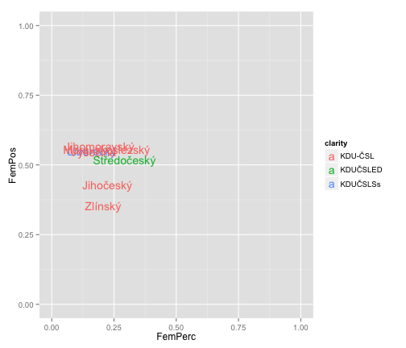

Krajské volby 2012
========================================================

This is an R Markdown document. Markdown is a simple formatting syntax for authoring web pages (click the **MD** toolbar button for help on Markdown).

When you click the **Knit HTML** button a web page will be generated that includes both content as well as the output of any embedded R code chunks within the document. You can embed an R code chunk like this:


```r
kraje <- read.csv("~/github/local/ElectionsCZ/CSVKraje/Kraje_CandRegDetails2012.csv")
library(ggplot2)
library(stringr)
library(plyr)
library(reshape)
```

```
## Attaching package: 'reshape'
```

```
## The following object(s) are masked from 'package:plyr':
## 
## rename, round_any
```

```r

kraje$female <- ifelse(str_detect(kraje$KandJmeno,"ová"),1,0)

ciselnik_kandidatky <- read.csv("~/github/local/ElectionsCZ/OtherData/Ciselnik_KZ_2012_kandidatky.csv")
ciselnik_kandidatky <- rename(ciselnik_kandidatky, c("KandNum" = "Kandidatka"))
kraje <- merge(ciselnik_kandidatky, kraje, by = "Kandidatka")

ciselnik_kraje <- read.csv("~/github/local/ElectionsCZ/OtherData/Ciselnik_KZ_2012_kraje.csv")
kraje <- merge(ciselnik_kraje, kraje, by = "Kraj")

kraje_pocetkand <- ddply(kraje, .(Kraj, Kandidatka), nrow)
kraje_pocetkand <- rename(kraje_pocetkand, c("V1"="PocetKand"))
kraje <- merge(kraje, kraje_pocetkand, by=c("Kandidatka","Kraj"))


avgfemale <- ddply(kraje, .(Kraj, Kandidatka), summarise,
                   FemPerc = mean(female))

kraje_fem <- subset(kraje, female == 1)
avgpostfemale <- ddply(kraje_fem, .(Kraj, Kandidatka), summarise,
                      FemPos = 1-mean(PoradiKand/PocetKand))

women <- merge(avgfemale, avgpostfemale, c("Kandidatka", "Kraj"))
women <- merge(women, ciselnik_kandidatky)
women <- merge(women, ciselnik_kraje)

rm(kraje_pocetkand, ciselnik_kraje, ciselnik_kandidatky, kraje_fem,
   avgfemale, avgpostfemale)

plot_women <- ggplot(subset(women, str_detect(women$KandName,"KDU")),
               aes(FemPerc, FemPos,
                  colour = as.factor(KandName),
                  label=KrajName)) +
          geom_text() +
          #facet_wrap(~KandName) + 
          scale_color_discrete("clarity") +
          ylim(0,1) + 
          xlim(0,1)
```


You can also embed plots, for example:


```r
plot(plot_women)
```

```
## Warning: conversion failure on 'KDU-ČSL' in 'mbcsToSbcs': dot substituted
## for <c4>
```

```
## Warning: conversion failure on 'KDU-ČSL' in 'mbcsToSbcs': dot substituted
## for <8c>
```

```
## Warning: conversion failure on 'KDUČSLED' in 'mbcsToSbcs': dot substituted
## for <c4>
```

```
## Warning: conversion failure on 'KDUČSLED' in 'mbcsToSbcs': dot substituted
## for <8c>
```

```
## Warning: conversion failure on 'KDUČSLSs' in 'mbcsToSbcs': dot substituted
## for <c4>
```

```
## Warning: conversion failure on 'KDUČSLSs' in 'mbcsToSbcs': dot substituted
## for <8c>
```

```
## Warning: conversion failure on 'KDU-ČSL' in 'mbcsToSbcs': dot substituted
## for <c4>
```

```
## Warning: conversion failure on 'KDU-ČSL' in 'mbcsToSbcs': dot substituted
## for <8c>
```

```
## Warning: conversion failure on 'KDUČSLED' in 'mbcsToSbcs': dot substituted
## for <c4>
```

```
## Warning: conversion failure on 'KDUČSLED' in 'mbcsToSbcs': dot substituted
## for <8c>
```

```
## Warning: conversion failure on 'KDUČSLSs' in 'mbcsToSbcs': dot substituted
## for <c4>
```

```
## Warning: conversion failure on 'KDUČSLSs' in 'mbcsToSbcs': dot substituted
## for <8c>
```

```
## Warning: conversion failure on ' Středočeský' in 'mbcsToSbcs': dot
## substituted for <c5>
```

```
## Warning: conversion failure on ' Středočeský' in 'mbcsToSbcs': dot
## substituted for <99>
```

```
## Warning: conversion failure on ' Středočeský' in 'mbcsToSbcs': dot
## substituted for <c4>
```

```
## Warning: conversion failure on ' Středočeský' in 'mbcsToSbcs': dot
## substituted for <8d>
```

```
## Warning: conversion failure on ' Jihočeský' in 'mbcsToSbcs': dot
## substituted for <c4>
```

```
## Warning: conversion failure on ' Jihočeský' in 'mbcsToSbcs': dot
## substituted for <8d>
```

```
## Warning: conversion failure on ' Vysočina' in 'mbcsToSbcs': dot
## substituted for <c4>
```

```
## Warning: conversion failure on ' Vysočina' in 'mbcsToSbcs': dot
## substituted for <8d>
```

```
## Warning: conversion failure on 'KDU-ČSL' in 'mbcsToSbcs': dot substituted
## for <c4>
```

```
## Warning: conversion failure on 'KDU-ČSL' in 'mbcsToSbcs': dot substituted
## for <8c>
```

```
## Warning: conversion failure on 'KDUČSLED' in 'mbcsToSbcs': dot substituted
## for <c4>
```

```
## Warning: conversion failure on 'KDUČSLED' in 'mbcsToSbcs': dot substituted
## for <8c>
```

```
## Warning: conversion failure on 'KDUČSLSs' in 'mbcsToSbcs': dot substituted
## for <c4>
```

```
## Warning: conversion failure on 'KDUČSLSs' in 'mbcsToSbcs': dot substituted
## for <8c>
```

 


